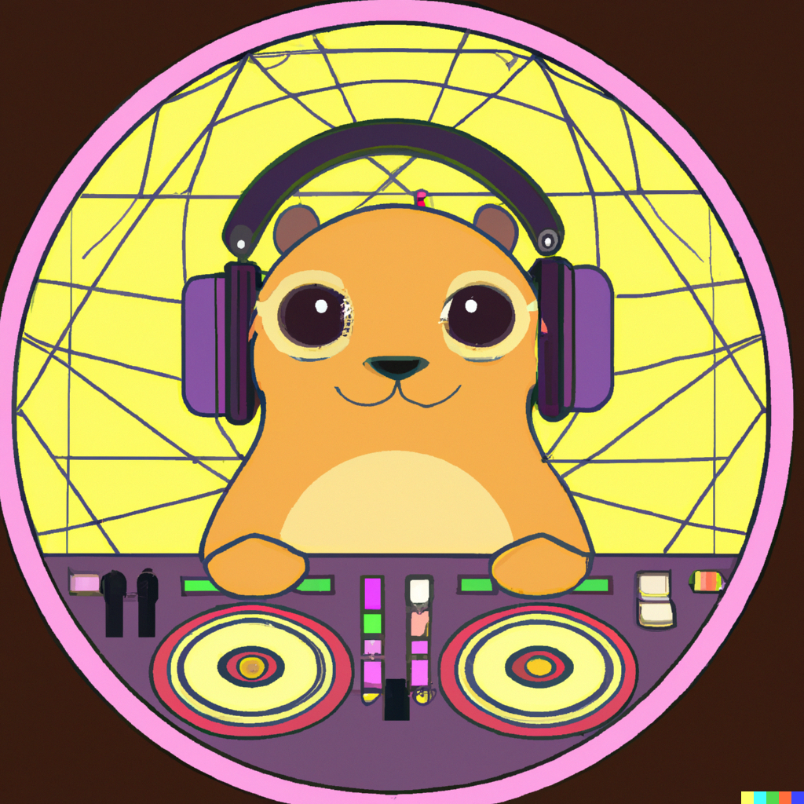

<div align="center">
    
</div>

# Golang wrapper for rekordbox databases

This is a wrapper to query and interact with the rekordbox 6 database

Motivation behind this tool is to enable better automation and integration with rekordbox. In previous versions it was possible to just use the rekordbox XML to query data, but since rekordbox 6 this is no longer possible

**Note**: This is a quickly hacked together project. Use at own risk, and make a backup of your database.

- [Golang wrapper for rekordbox databases](#golang-wrapper-for-rekordbox-databases)
	- [What is this exactly?](#what-is-this-exactly)
	- [Install](#install)
	- [Usage](#usage)
	- [Usage Example: Query all playlists](#usage-example-query-all-playlists)
	- [Usage Example: Get the most recent plays/songs to use in overlays](#usage-example-get-the-most-recent-playssongs-to-use-in-overlays)
	- [Usage without generated helper functions](#usage-without-generated-helper-functions)
	- [Contributing](#contributing)
		- [How to regenerate the models (after rekordbox upgrades)](#how-to-regenerate-the-models-after-rekordbox-upgrades)
		- [Extending the default generated code with custom code](#extending-the-default-generated-code-with-custom-code)
		- [Extending code generation](#extending-code-generation)
	- [Prior art](#prior-art)

## What is this exactly?

This wrapper is mostly automatically generated by connecting to the rekordbox database and using it's schema to create a bunch of models including helper functions around SQL commands. You can find those in `rekordbox/`, and the dumped schema in `db/schema.sql`

Docs are available at https://pkg.go.dev/github.com/dvcrn/go-rekordbox/rekordbox

## Install

```
go get github.com/dvcrn/go-rekordbox
```

## Usage

Create a new `rekordbox.Client` with `rekordbox.NewClient` and use it to query

You'll need 2 file pathes:

- path to `options.json`, on mac this is typically `~/Library/Application Support/Pioneer/rekordboxAgent/storage/options.json`, on windows potentially in `C:\Users\XXXX\AppData\Roaming\Pioneer\rekordboxAgent\storage`
- path to the `app.asar` file that's bundled with rekordbox, on mac this is `/Applications/rekordbox 6/rekordbox.app/Contents/MacOS/rekordboxAgent.app/Contents/Resources/app.asar`, on windows potentially in `C:\Users\XXXX\AppData\Roaming\Pioneer\rekordboxAgent\storage`

```golang
package main

import (
	"context"
	"fmt"

	"github.com/dvcrn/go-rekordbox/rekordbox"
)

func main() {
	ctx := context.Background()

	homeDir, err := os.UserHomeDir()
	if err != nil {
		panic(err)
	}

	optionsFilePath := filepath.Join(homeDir, "/Library/Application Support/Pioneer/rekordboxAgent/storage/", "options.json")

	asarPath := "/Applications/rekordbox 6/rekordbox.app/Contents/MacOS/rekordboxAgent.app/Contents/Resources/app.asar"

	client, err := rekordbox.NewClient(optionsFilePath, asarPath)
	if err != nil {
		panic(err)
	}
	defer client.Close()

	// your amazing stuff here
```

## Usage Example: Query all playlists

```golang
package main

import (
	"context"
	"fmt"

	"github.com/dvcrn/go-rekordbox/rekordbox"
)

func main() {
	ctx := context.Background()

	homeDir, err := os.UserHomeDir()
	if err != nil {
		panic(err)
	}

	optionsFilePath := filepath.Join(homeDir, "/Library/Application Support/Pioneer/rekordboxAgent/storage/", "options.json")

	asarPath := "/Applications/rekordbox 6/rekordbox.app/Contents/MacOS/rekordboxAgent.app/Contents/Resources/app.asar"

	client, err := rekordbox.NewClient(optionsFilePath, asarPath)
	if err != nil {
		panic(err)
	}
	defer client.Close()

    // query all playlists
	playlists, err := client.AllDjmdPlaylist(ctx)
	if err != nil {
		panic(err)
	}

	for _, playlist := range playlists {
		fmt.Printf("%s\n", playlist.Name.String)

        // query all songs that are in the playlist
		playlistSongs, err := client.DjmdSongPlaylistByPlaylistID(ctx, playlist.ID)
		if err != nil {
			panic(err)
		}

        // get all songs within the playlist
		for _, playlistSong := range playlistSongs {
			content, err := client.DjmdContentByID(ctx, playlistSong.ContentID)
			if err != nil {
				panic(err)
			}

			fmt.Printf("\t%s\n", content.Title.String)
		}
	}
}
```

Output:

```
Tech
        8A - 125 - La Candela Viva (Extended Mix)
        10A - 125 - Do It To It (Extended Mix)
        8B - 125 - Milk Shake (Original Mix)
        6A - 126 - You Give Me A Feeling (Original Mix)
        12B - 129 - My Humps (Original Mix)
        4A - 126 - Want To Love (Extended Mix)
        12B - 126 - Technologic (Original Mix)
        9B - 126 - Disconnected (Extended Mix)
        (...and so on)
```

## Usage Example: Get the most recent plays/songs to use in overlays

```golang
	ctx := context.Background()

	homeDir, err := os.UserHomeDir()
	if err != nil {
		panic(err)
	}

	optionsFilePath := filepath.Join(homeDir, "/Library/Application Support/Pioneer/rekordboxAgent/storage/", "options.json")

	asarPath := "/Applications/rekordbox 6/rekordbox.app/Contents/MacOS/rekordboxAgent.app/Contents/Resources/app.asar"

	client, err := rekordbox.NewClient(optionsFilePath, asarPath)
	if err != nil {
		panic(err)
	}
	defer client.Close()

	songs, err := client.RecentDjmdSongHistory(ctx, 10)
	if err != nil {
		panic(err)
	}

	fmt.Println("Your recent songs")
	for _, song := range songs {
		content, err := client.DjmdContentByID(ctx, song.ContentID)
		if err != nil {
			panic(err)
		}

		fmt.Printf("\t%s (%s)\n", content.Title.String, song.ContentID.String)
	}
```

Output:

```
Your recent songs
        9A - 127 - Intense (Original Mix) (123557411)
        7A - 127 - Gradual Disruption (Original Mix) (154120490)
        7A - 126 - In Chicago (Extended Mix) (175359939)
        7A - 126 - What I Need (Extended) (59136374)
        10A - 127 - Romeo (Wh0 Extended Festival Remix) (59823290)
        9A - 126 - Higher (Original Mix) (183964619)
        9A - 125 - Gimme Some Keys (Original Mix) (247948942)
        10A - 125 - Do It To It (Extended Mix) (150109009)
        1B - 126 - Bad Habits (MEDUZA Extended Remix) (173015998)
        12B - 130 - Last Step (A*S*Y*S Remix) (246529)
```

## Usage without generated helper functions

You can also directly access the sqlx.DB object by calling `client.GetDB()`, and use that to issue queries directly

## Contributing

### How to regenerate the models (after rekordbox upgrades)

There's a handy Makefile command that does all of this for you (works only on Mac):

```
make genmodels
```

### Extending the default generated code with custom code

To add custom functions ontop of the existin generated code, just create a new file under `rekordbox/` and name it accordingly, without `xo` in the name.

For example, the recent song history implementation is done in `djmdsonghistory.go` which extends `djmdsonghistory.xo.go` (the auto-generated one)

### Extending code generation

Code generation is handled by [xo](https://github.com/xo/xo). To extend the generated code, update the xo template in `tpl/schema.xo.go.tpl`. Once you updated that, re-generate the models with `make genmodels` to see your changes

## Prior art

- Initial database connection code taken from [supbox](https://github.com/gabek/supbox)
